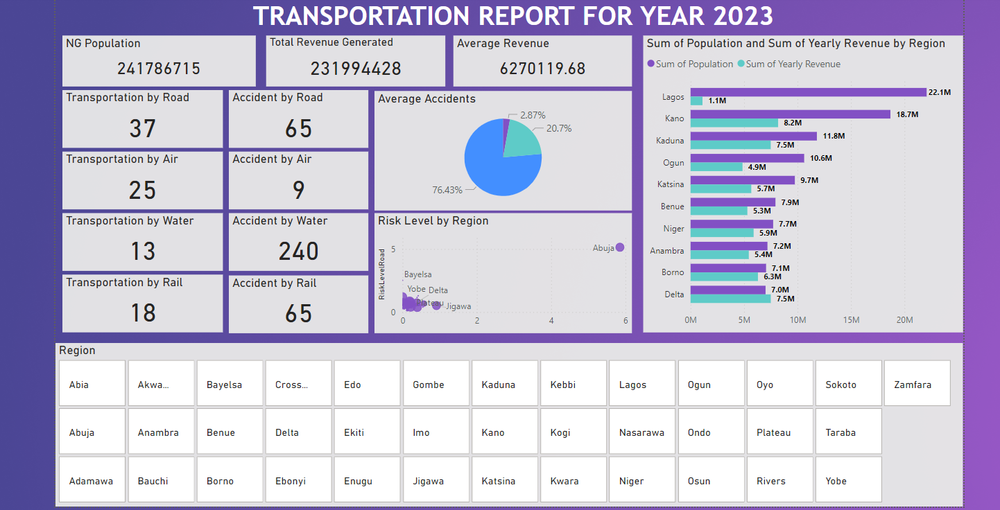
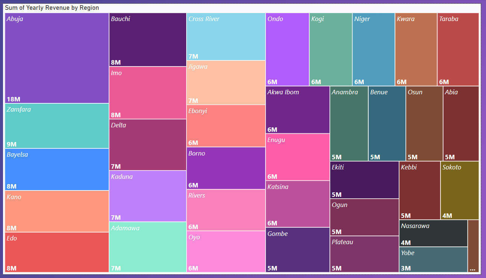
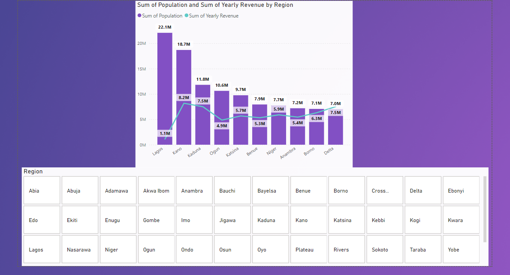

# Transportation-Analysis-Report
## Introduction
This was a group project during **Incubator Future Clan Bootcamp** on **Data Analysis**



## Data Sources
- Google Spreadsheet
- Data collected via scrapping the internet

## Tools Used
- Power Bi [Microsoft](https://microsoft.com/)
- Google Spreadsheet [Google](https://docs.google.com/spreadsheets)

### QUERY USED
```
1. Total Population of Regions
2. Regions with Different mode of transportation
3. Risk Level
4. Sort ability using Slicer
```
### The Result



